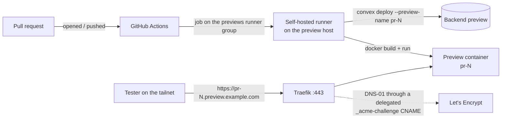

# self-hosted-pr-previews

Private preview environments for every pull request, on a machine you already
own — on your own domain, over HTTPS, with a backend of their own — and torn
down, backend included, when the pull request closes.

Every same-repository pull request gets
`https://pr-<number>.preview.<your-domain>`. A self-hosted GitHub Actions runner
builds it, Traefik serves it with a wildcard Let's Encrypt certificate, and only
people on your Tailscale tailnet can reach it.

**This is not a tool you install.** It is a working setup written down as
runbooks and reference templates, so that an AI coding agent can rebuild it on
your machine for your projects. Everything specific to one setup lives in a
single config file. The one piece of real code is a small dashboard that lists
the running previews and streams their logs.

## Why

Hosted preview deployments are excellent until a preview has to live on *your*
domain. The common reason is sign-in: auth providers only redirect back to
registered URLs. WorkOS, for example, accepts wildcard redirects like
`https://*.preview.example.com/callback` but refuses them on public-suffix
domains such as `*.vercel.app`, so previews on the host's domain cannot sign
in. Custom domains for preview deployments are typically a paid add-on — on
Vercel it was around $100/month for the team this was built for.

Meanwhile, a desktop or home server sits idle most of the day with far more CPU
than a preview build needs, and a tailnet makes it private for free.

## How it works



| Piece | What it does |
| --- | --- |
| Preview host | A dedicated WSL2 distro on Windows, or a Linux box, that stays on. |
| GitHub runner | Registered per org (or repo), in a runner group that only private repos can use. |
| Docker Engine | Builds each PR's image and runs its container. |
| Tailscale | Makes the host reachable only from your tailnet; access rules decide who can open previews. |
| Traefik | One HTTPS entrypoint for every project. Routes `pr-N.preview.<domain>` to the right container from Docker labels, and holds one wildcard certificate per project. |
| DNS | `*.preview.<domain>` points at the host's tailnet IP. Each project's `_acme-challenge` record is a CNAME into a neutral zone, so the host's DNS token never touches a project's own zone. |
| Project workflow | `preview.yml` in each project: build, deploy the backend preview, start the container; on close, remove all three. |
| Secrets | Doppler service tokens in a GitHub `preview` environment (or plain GitHub secrets). |
| Backend previews | Convex preview deployments, seeded on creation and deleted on close (swap for your backend). |
| Dashboard | [`apps/dashboard`](apps/dashboard): lists previews across projects, links their PRs and runs, streams container logs. Read-only. |

## Using it

With an agent (Claude Code, Codex, Cursor, …), from a clone of this repository:

> Read AGENTS.md and set up self-hosted PR previews for my projects.

The agent interviews you to write `config.yaml`, then works through
[`docs/`](docs) in order, checking each step before the next and stopping to ask
before it touches DNS, access policies, cloud dashboards or your project repos.

By hand: copy `config.example.yaml` to `config.yaml`, fill it in, and follow the
runbooks from [`docs/01-host.md`](docs/01-host.md). Read
[`docs/pitfalls.md`](docs/pitfalls.md) first — nearly every hour lost building
this is in there.

## What's here

```
AGENTS.md                 how an agent should run the setup
config.example.yaml       every setup-specific value, in one place
docs/                     runbooks 01–12, in order, plus pitfalls.md
templates/host/           WSL, Docker, Tailscale and keepalive files
templates/proxy/          Traefik + dashboard compose file
templates/workflows/      a project's preview.yml and preview-health.yml
apps/dashboard/           the preview dashboard (Go)
articles/                 the story behind this setup
.github/                  CI and Dependabot for this repository
```

The longer story — why this exists and what went wrong along the way — is in
[`articles/replacing-paid-preview-deployments.md`](articles/replacing-paid-preview-deployments.md).

## Requirements

- A machine that stays on: Windows with WSL2 (2.4 or newer), or Linux with
  systemd. Preview builds are the heavy part — 8+ cores and 16 GB+ of RAM make
  them pleasant.
- Admin on the GitHub org (or repo) whose pull requests get previews.
- A domain on a DNS provider with an API (Cloudflare is documented), and a
  second zone you own that can hold ACME challenge records.
- A Tailscale tailnet (the free plan is enough).
- Optional, documented because the original setup used them: Doppler, Convex,
  WorkOS or Clerk. Each runbook says what to change for something else.

## Tradeoffs

- **Your machine is the uptime.** A reboot, an OS update or a power cut takes
  previews down until the host is back — the setup comes back unattended, but
  not instantly.
- **Previews run pull-request code on your machine.** The workflow refuses forks
  and Dependabot, and the host is isolated from the rest of the machine, but this
  is for a team whose PR authors you trust — not for public contributions.
- **One runner builds one preview at a time.** Register more runners for more
  concurrency.
- **Private by design.** Testers need to be on your tailnet. A public variant is
  possible but means putting your own authentication in front of every preview.

## License

[MIT](LICENSE)
